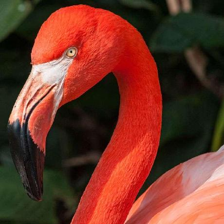

# Web developer


## Ivan Antonov

* Write me
    1. [via Telegram](https://t.me/antonovkrez)
    2. [via Email](mailto:antonovdev88@gmail.com)

---

* **About me**:
    In past worked as historian. Currently, junior PHP developer. 
* **Objective**: 
    Level up my JS knowledge, to start working with React and Vue frameworks and to promote to middle web developer.
* **Stack of technologies**: 
    HTML, CSS, JS, jquery, PHP, composer, git and a little bit docker.
---
* **Code example**: 
    ``` 
    function(table, name, fileName) {
        if (!table.nodeType) table = document.getElementById(table)
        let ctx = {worksheet: name || 'Worksheet', table: table.innerHTML}
        let resuri = uri + base64(format(template, ctx))
        downloadURI(resuri, fileName);
    } 
    ```
---
* **Work experience**: 
    * **Trainee web developer** - _Request design_ (august 2020 - december 2020) 
    * **Junior PHP developer** - _amoCRM_ (february 2021 - march 2021)
    * **Junior PHP developer** - _Labirint_ (march 2021 - present)

* **Education**:
    * https://htmlacademy.ru/
    * https://hexlet.io/

* **English** :
    * B2